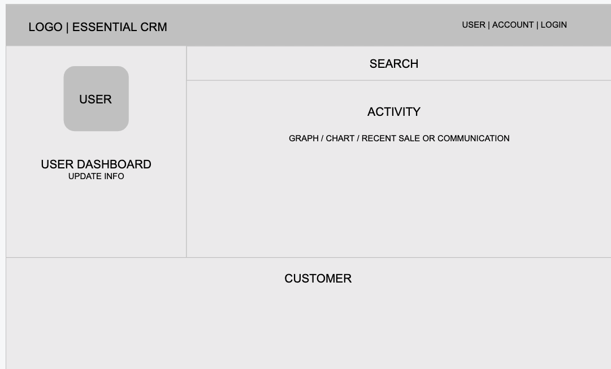
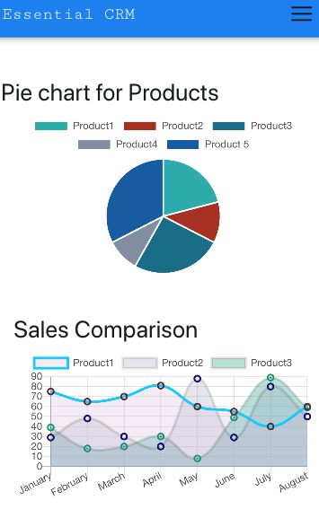

# EssentialCRM

##
**_Project Description_**

essentialCRM is a Customer Relationship Management tool designed to provide a simple, no frills way to keep track of communications and transactions with your clients. It will store User account information and Client contact information with communication and transaction records associated to both the purchasing client and the user responsible for the sale.

# Deployed Applications

- Frontend - https://essentialcrm323.herokuapp.com/
- Backend - https://glacial-sands-49555.herokuapp.com/

##
**_Wireframes_**

 

##
**_Example_**

This is what app looks like

 





##
**_MVP_**
##
**_User Stories_**

* As a user, I would be able to search client and user details.

* As a user, I want to see listings of all clients based on search criteria.

* As a user, I want to be able to update client information.

* As a user, I want to be able to update user information.

* As a user, I want to be able to track customers.

* As a user, I want to be able to track sales.


##
**_Post MVP Stretch Goal_**

* As a user, I would like to display an analytics dashboard and and monitor all activities for sales and clients.


### Technologies Used
- React
- React bootstrap
- React Router DOM
- React Chart
- Material UI

## Testing Technologies
- Jest
- Enzyme

##
**_Installation Instructions_**

To set up app locally on your system: 

* Install VsCode locally and ensure it is running.

* Fork and clone this repository

* Change into new directory and open file in VsCode

* Install npm dependencies:
```
$ npm install
```

* Run the application with npm start
```
$ npm start
```

* You will also need a run a local instance of the EssentialCRM Backend API. You can find that application here. https://github.com/statst/Group-project-CRM-backened

##
**_Contribute_**

Source code: https://github.com/statst/Group-Project-CRM-frontend

Find our application on: https://essentialcrm.herokuapp.com/

# Contributor Team
- Foolan Bhosale - https://www.linkedin.com/in/foolan-bhosale
- Jyoti Shinde - https://www.linkedin.com/in/jyoti-shinde/
- TK Nguyen - https://www.linkedin.com/in/tuongknguyen/
- Rory Ellis - https://www.linkedin.com/in/roryellis/
